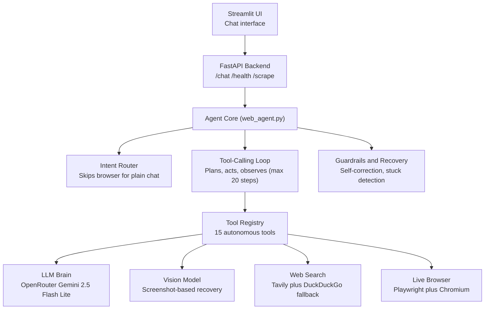

# Agentic-Web

**An autonomous AI agent that searches, browses, clicks, fills forms, and completes multi-step tasks on the web — without hand-holding.**

Built for the **Microsoft AI Build Hackathon** by **Team Legends**.

---

## 📖 Problem Statement

Every day we repeat the same web tasks — searching across sites, filling out the same forms, clicking through multi-step flows just to get one thing done. Most "AI agents" today can read a page and summarize it, but the moment they need to *act* — click a button, fill a field, recover from a broken layout — they fail or give up.

**Agentic-Web** is our answer: an agent that plans a task, actually drives a real browser to complete it, recovers when something goes wrong, and reports back with proof of what it did.

## ✨ What It Does

Agentic-Web is a full-stack autonomous web agent that:

- Searches the web and opens real pages in a live Chromium browser
- Clicks buttons, fills and submits forms, selects options, and scrolls — just like a person would
- Plans before acting, observes the page before clicking blindly, and self-corrects when stuck
- Falls back to a vision model (literally looks at a screenshot) when it can't find something in the page's code
- Pauses and asks a human only for logins, MFA, or CAPTCHAs — then resumes on its own
- Extracts structured data with confidence levels — never invents values
- Finishes every task with a clear answer **and the sources it visited**

## 🏗️ Architecture Overview



**Request flow:** a chat message hits `/chat` → the **intent router** decides if browsing is even needed → the **tool-calling loop** asks the LLM which tool to call next → that tool executes against Playwright, search, or the vision model → results feed back into the loop → **guardrails** verify the agent actually browsed real pages and cited sources before it's allowed to finish.

## 🧰 Tech Stack & Dependencies

| Layer | Technology |
|---|---|
| Backend framework | FastAPI (async, Python 3.13) + Uvicorn |
| Browser automation | **Playwright** (Chromium) |
| Agent orchestration | Custom async tool-calling loop (no LangGraph) |
| LLM provider | OpenRouter (OpenAI-compatible API) |
| Web search | Tavily API + DuckDuckGo HTML fallback |
| Content parsing | BeautifulSoup4 + lxml |
| Config | pydantic-settings + python-dotenv |
| Package manager | uv |
| Frontend | Streamlit chat UI |

Full dependency list lives in `backend/pyproject.toml`.

## 🧠 AI Tools Used

| Tool | Role in the project |
|---|---|
| **OpenRouter (Gemini 2.5 Flash Lite)** | Core reasoning engine — drives the agent's planning, tool selection, and final answers |
| **Vision model (Gemini 2.5 Flash / Nvidia Nemotron)** | Analyzes screenshots to locate buttons and fields when DOM-based clicking or filling fails |
| **GitHub Copilot (Microsoft)** | Used throughout development for pair-programming — scaffolding tools, refactoring the agent loop, and iterating on the system prompt |
| **Playwright (Microsoft)** | Powers every browser action the agent takes — navigation, clicking, typing, scrolling, screenshots |
| **Tavily API** | Primary web search provider, with DuckDuckGo scraping as a zero-downtime fallback |

## ⚙️ Setup Instructions

### Prerequisites
- Python 3.13
- [uv](https://docs.astral.sh/uv/) package manager
- An OpenRouter API key from [openrouter.ai](https://openrouter.ai)

### 1. Clone the repo
```bash
git clone https://github.com/yashviPayal/Agentic-Web.git
cd Agentic-Web
```

### 2. Backend setup
```bash
cd backend
uv sync
uv run playwright install chromium

cp .env.example .env
# edit .env and set OPENROUTER_API_KEY (and optionally TAVILY_API_KEY)

uv run uvicorn main:app --reload
```
The backend runs at `http://localhost:8000`. Check `http://localhost:8000/health` → should return `{"status": "ok"}`.

### 3. Frontend setup
```bash
cd frontend
uv sync                # or: pip install -r requirements.txt
streamlit run app.py
```
The frontend runs at `http://localhost:8501` (must match `FRONTEND_URL` in `.env`).

### Environment variables (`backend/.env`)

| Variable | Required | Default | Description |
|---|---|---|---|
| `OPENROUTER_API_KEY` | Yes | — | Your OpenRouter API key |
| `OPENROUTER_MODEL` | No | `google/gemini-2.5-flash-lite` | LLM used for agent reasoning |
| `OPENROUTER_BASE_URL` | No | `https://openrouter.ai/api/v1` | OpenRouter endpoint |
| `TAVILY_API_KEY` | No | — | Enables Tavily search (DuckDuckGo used otherwise) |
| `MODE` | No | `development` | `development` = headed browser + human handoff for login/MFA. `production` = headless + no handoff (use on Render) |
| `FRONTEND_URL` | No | `http://localhost:8501` | Used for CORS / referer headers |
| `APP_TITLE` | No | `Agentic Web AI` | App title sent to OpenRouter |
| `SAVE_SCREENSHOTS_LOCAL` | No | `false` | Save debug screenshots to `backend/screenshots/` |

## 🔌 API Endpoints

| Method | Route | Purpose |
|---|---|---|
| `GET` | `/health` | Health check (includes `mode`) |
| `GET` | `/config` | Deployment config (`mode`, `human_involvement_enabled`, `playwright_headed`) |
| `POST` | `/chat` | Main agent endpoint — send conversation, get the agent's response, tools used, and sources |
| `POST` | `/scrape/` | Direct page scrape (bypasses the agent — useful for testing) |
| `GET` | `/human/status` | Check if the agent is waiting on a human (development only) |
| `POST` | `/human/response` | Submit a human response to unblock the agent (development only) |

## 🛠️ The 15 Tools

`search_web` · `browse_web` · `navigate_page` · `click_element` · `fill_form_field` · `read_form_fields` · `select_form_option` · `scroll` · `get_current_url` · `go_back` · `take_screenshot` · `extract_data` · `observe_page` · `request_human_input` · `finish_task`

## 🗺️ Roadmap

- Multi-tab parallel browsing for side-by-side comparisons
- Persistent task history / memory across sessions
- Real-time streaming of agent steps over WebSockets
- Structured JSON output mode for downstream automation
- File download support (PDFs, CSVs)

## 👥 Team — Legends

| Name | Role |
|---|---|
| **Rohit Rathod** | Team Lead — agent architecture, backend & tool orchestration |
| **Yashvi Dalsaniya** | Developer — frontend integration, testing & demo |

---

Built with ❤️ for **Microsoft AI Build**.